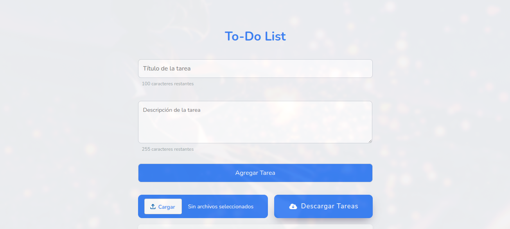
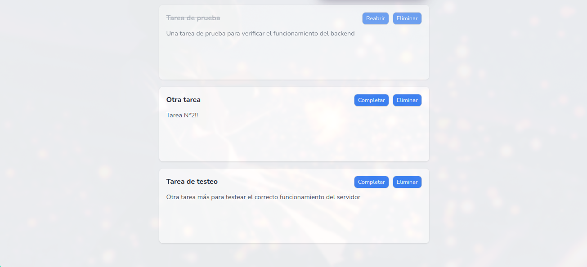
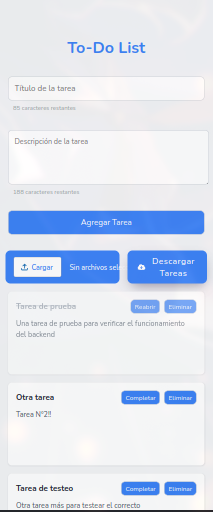

# To-Do List

Aplicación web hecha en Python como Backend y con tecnologías FrontEnd vanilla para la parte visual. Este proyecto funciona 100% en local, los pasos de instalación se darán más adelante.  


## Screenshots






## Estructura

La aplicación web cuenta con desarrollo de API Rest hechos con **FastAPI** y **SQLAlchemy** como tecnologías principales en el desarrollo del servidor, usando **Uvicorn** para su ejecución. Por otro lado, está el FrontEnd usando **HTML5**, **CSS3** y **JavaScript Vanilla** para el desarrollo visual y su conexión dinámica entre el usuario y la base de datos mediante el BackEnd.
## Features

- Diseño minimalista y fácil de usar
- Agrega, visualiza, edita y elimina tareas directamente desde la interfaz de usuario
- Diseño responsive
- En linux, cuenta con un archivo ejecutable de configuración para conexión a base de datos de manera segura
- Permite ver la cantidad de caracteres restantes permitidos en tiempo real
- Cuenta con la opción de importar tareas únicamente en formato JSON
- Puede exportar las tareas guardadas en la base de datos en un solo click


## API Reference

#### Obtener todas las tareas 

```http
  GET /tareas
```

| Parameter | Type     | Description                |
| :-------- | :------- | :------------------------- |
| `none` | `JSON List` | Se usa al cargar la GUI. También se usa para exportar tareas. |

#### Obtener una tarea específica  

```http
  GET /tareas/{id}
```

| Parameter | Type     | Description                       |
| :-------- | :------- | :-------------------------------- |
| `id`      | `JSON` | Devuelve la tarea que coincida con el ID |


#### Agregar una tarea  

```http
  POST /tareas
```

| Parameter | Type     | Description                       |
| :-------- | :------- | :-------------------------------- |
| `Tarea`      | `JSON` | Obtiene los campos de la nueva tarea |


#### Editar una tarea

```http
  PUT /tareas/{id}
```

| Parameter | Type     | Description                       |
| :-------- | :------- | :-------------------------------- |
| `id`      | `JSON` | Actualiza el campo de estado de la tarea |

#### Eliminar una tarea

```http
  DELETE /tareas/{id}
```

| Parameter | Type     | Description                       |
| :-------- | :------- | :-------------------------------- |
| `id`      | `string` | Elimina la tarea en cuestión |


#### Importar una lista de tareas

```http
  POST /tareas/importar
```

| Parameter | Type     | Description                       |
| :-------- | :------- | :-------------------------------- |
| `File`      | `JSON` | Recibe una lista de tareas JSON y la carga a la base de datos|


## Instalación

Primero asegurate de tener MySQL >= 8.0 y Python >= 3.10 instalado en tu equipo:

```bash
  python --version
  mysql --version
```

NOTA: Si usar una distribución de linux basada en Arch Linux, debes instalar MySQL desde el repositorio **AUR** o **compilarlo** desde el código fuente.


#### LINUX / MacOS
```bash
git clone https://github.com/DavMateo/To-Do_List_Curso_IA.git
cd To-Do_List_Curso_IA
chmod +x ./configDB.sh
./configDB.sh
```  
Esto iniciará un **Script** que verificará si tu PC está preparado para ejecutar el servidor. En caso de ser afirmativo, creará un entorno virtual de Python e instalará ahí todas las dependencias necesarias.  

Importante estar pendiente, puesto que tendrás que ingresar las credenciales de tu base de datos MySQL (Local o Remoto) para iniciar el servidor.  


#### WINDOWS
```bash
git clone https://github.com/DavMateo/To-Do_List_Curso_IA.git
```

Luego, dirigirse al directorio donde se clonó el repositorio y crear un archivo ```.env``` que tendrá las siguientes características:

```bash
DATABASE_USER = user
DATABASE_PASSWORD = password
DATABASE_HOST = localhost / custom host
DATABASE_PORT = 3306
DATABASE_NAME = tareas
```

Guardar y luego ejecutar lo siguiente para crear el entorno virtual:

```bash
python -m venv .venv
source .venv/bin/activate
```

Para instalar las dependencias pertinentes ejecutar:
```bash
pip install --upgrade pip
pip install -r requeriments.txt
```

Por último, inicia el servidor
```bash
uvicorn app:app --host 0.0.0.0 --port 8000 --reload --log-level debug
```

Independientemente del sistema operativo, debes dirigirte al navegador de tu preferencia y poner ```http://127.0.0.1:8000/```
